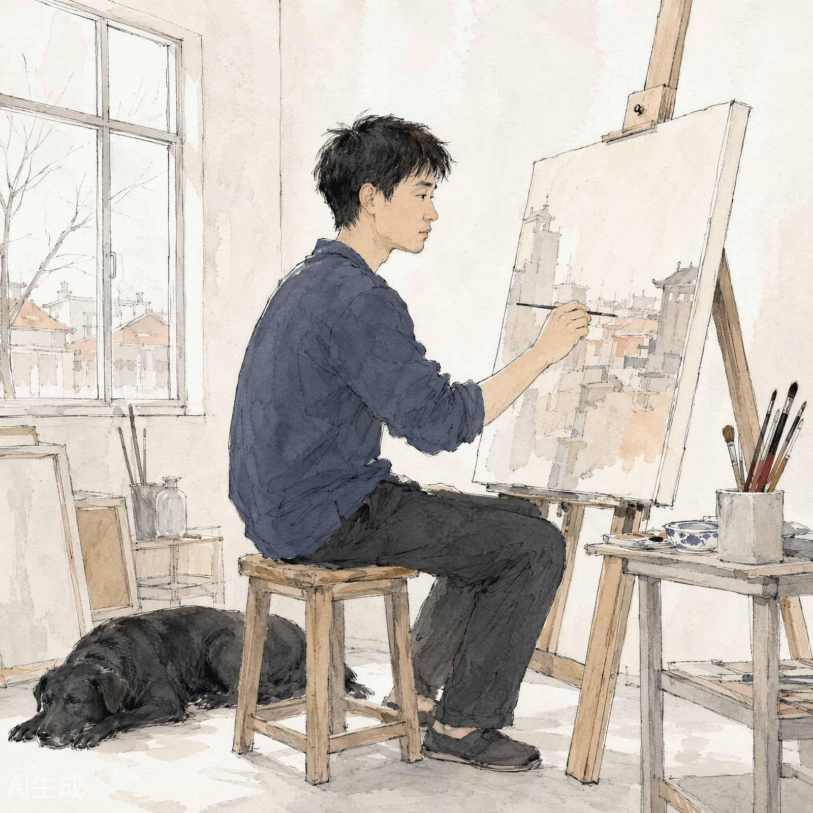
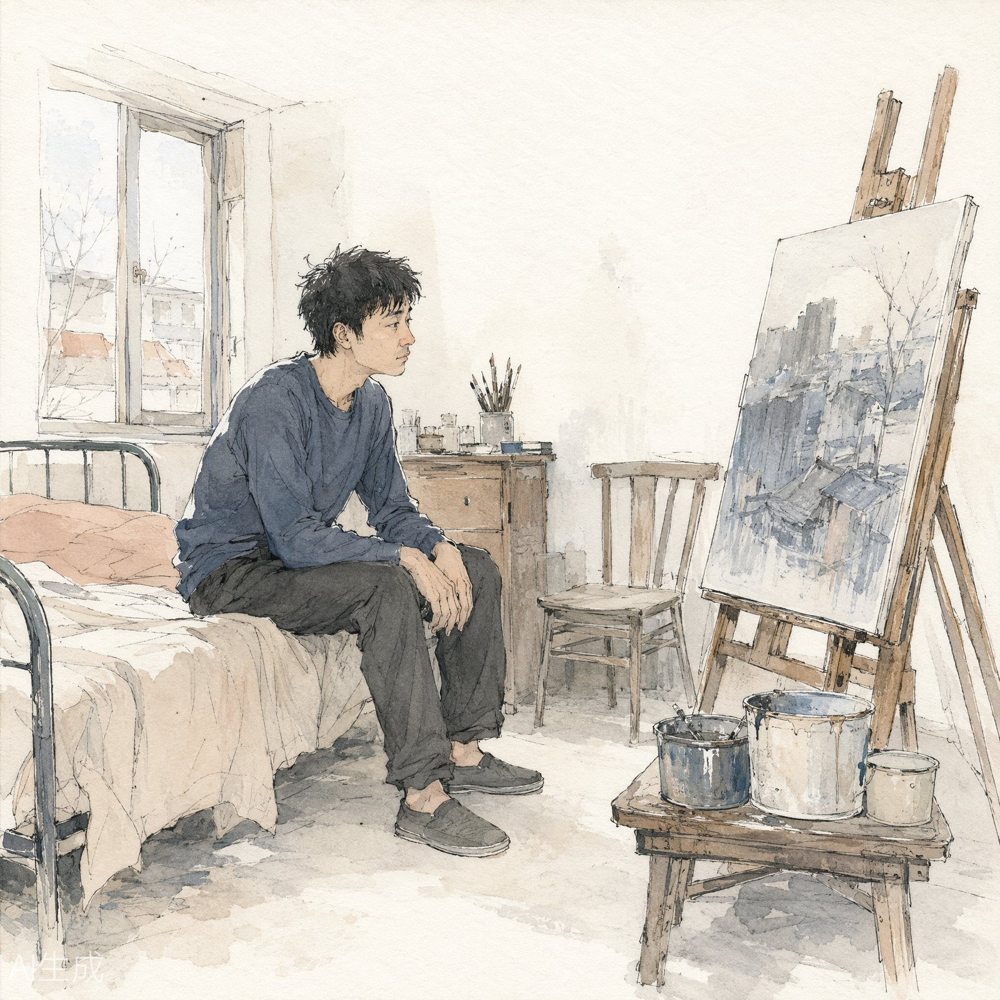
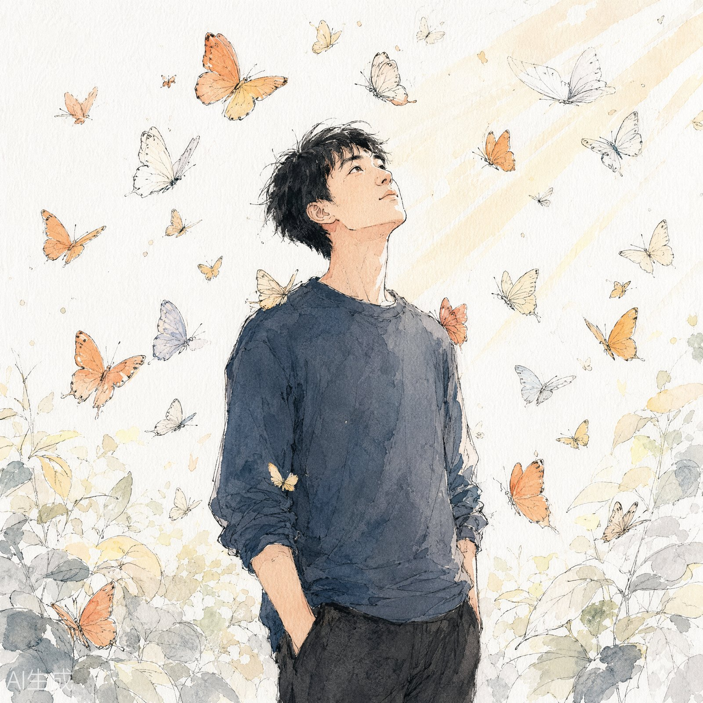
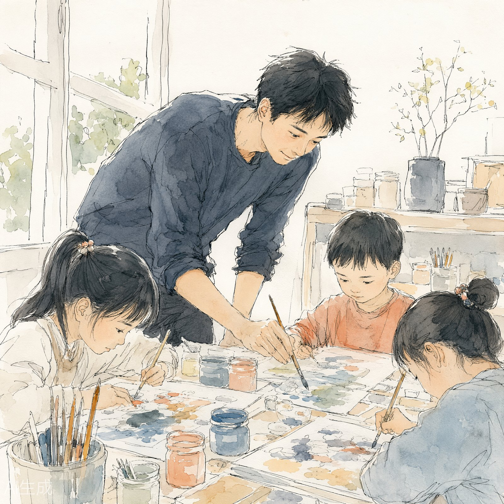

# 实测案例 · 《蝴蝶少年不再推石头上山》全套配图

- 文章：申三《蝴蝶少年不再推石头上山》（画家向帅自述访谈）
- 风格档案：`styles/editorial-ink-wash.md`（报刊淡彩，参考图 `assets/p718126702.jpg`）
- 出图后端：Kimi image_generation，2K · 1:1 · opaque；参考图上传后生成接口连续返回 HTTP 424，本套图按降级方案改用纯锚定段提示词生成
- **系列一致性机制**（references/style-guide.md 四点五节）：全套图共享同一角色锚定 + 统一情绪光线锚定 + `--no-text`，组装命令（每张）：
  ```bash
  python scripts/build_prompt.py --style editorial-ink-wash \
    --scene "<场景中文>" --scene-en "<Scene EN>" --ratio "1:1" \
    --character "<角色锚定>" --no-text
  ```

## 系列锚定（全套逐字复用）

**角色锚定 · Protagonist**：
> Xiang Shuai, a lean Chinese male artist in his late twenties, short slightly messy black hair, gentle tired eyes, wearing a dark slate-blue long-sleeve cotton shirt and plain dark trousers

**文字策略**：`--no-text`（画面不出现任何可读文字，贴合中文文章场景）

## 场景一 · 发光的狗（对应章节【发光的狗】）



- 原文依据："陪着我就是那只黑色的狗就是皮皮""我用小软毛笔蘸着油，在画布上一层层地叠了十几遍""早上五六点就起来……站在画布前"
- 建议插入位置：【发光的狗】章节开头
- Scene EN: In a sparse Beijing studio in even daylight, the artist practices alone at a canvas, a small soft brush in hand, his black dog Pipi lying on the bare floor beside him, plain walls, quiet ascetic mood

## 场景二 · 宋庄二十平米（对应章节【坐井观山】）



- 原文依据："花了两千块钱布置，买来的全是二手家具。一张床，一个画架，几个装颜料的铁皮桶""把颜色拉到一个很灰的状态里面"
- 建议插入位置：【坐井观山】章节开头
- Scene EN: A tiny twenty-square-meter rented room in Songzhuang furnished with second-hand pieces bought for two thousand yuan: an iron-frame bed, a wooden easel holding a half-finished grey-blue painting, a few tin buckets of paint; the artist sits on the bed edge gazing at his canvas, daytime, quiet humble mood, soft muted daylight

## 场景三 · 蝴蝶少年（对应章节【蝴蝶少年】，标题场景）



- 原文依据："它的羽翼在阳光下面有光芒挺美的，但你细细地看，它有很多小绒毛""蝴蝶的震颤就是让我们慢慢磨合，在精神和肉体上达到和谐和统一"
- 建议插入位置：【蝴蝶少年】章节；亦可作全文头图
- Scene EN: The artist as a slender young man standing in slanting dusk sunlight, surrounded by glowing butterflies, their wing fuzz trembling in the light, he looks up quietly, spirit and flesh in harmony, restrained hopeful mood, soft muted golden light

## 场景四 · 下凡（对应章节【下凡】）



- 原文依据："你需要进入生活，成为从天上下凡的艺术家""我在教小龄段的 4 岁，然后到 15 岁中间的小朋友"
- 建议插入位置：【下凡】章节
- Scene EN: In a humble weekday art classroom, the artist bends over a table guiding a small group of children painting, paint jars and papers spread out, the children absorbed in their work, gentle warm everyday mood, soft muted daylight

## 目检记录（第三版 · 来图识别 SOP + 样张核验闭环）

**风格档案重写**（v2 锚定段）：参考图逐区域放大目检后确认其为**高调淡彩**——发丝级细线、几乎不排线、色块仅一两层、留白过半、全画无深色阴影。v2 锚定段五句齐全（明度基调句 `High-key ... bright and airy` / 线条定量句 `a few sparse hairline strokes, never filled in` / 色块层数句 `only one or two thin tones per shape` / 负向形态句 `No dark shadows anywhere, no dramatic lighting` / 签名禁令句），负面约束按参考图反推追加 `no dense cross-hatching, no dark shadows, no dramatic lighting, no chiaroscuro, no graphic-novel shading, no moody darkness`。

**场景-明度兼容改写**：场景一由"深夜一盏台灯"改为"白天画室"（原文"早上五六点就起来……站在画布前"依据充分；高调档案配夜景孤灯场景必然跑偏，按 style-guide.md 第五节规则改写）。

**对图核验**（样张 vs 参考图，清单见 references/style-audit-checklist.md）：

| 核验项 | 结果 |
|--------|------|
| 明度基调 | ✅ 一致（高调，无深色阴影） |
| 线条密度/粗细 | ✅ 一致（细线、几乎无排线） |
| 色块层数 | ✅ 一致（一两层薄色，晕斑可见） |
| 色板 | ✅ 一致（浅桃/米白/浅青灰/藏蓝/淡橙） |
| 留白比例 | ✅ 一致（大面积白纸） |
| 夸张度 | ⚠️ 偏一点（样张人物偏写实，参考图为漫画式夸张；有意保留——人物专访配图不宜五官变形） |
| 禁忌项 | ✅ 无签名/日期/水印/可读文字 |
| 系列一致 | ✅ 四张主角同一人、色温统一 |

- 第二版问题（暗黑素描感、满幅排线、强明暗对比）已通过明度基调句 + 负向形态句 + 场景-明度兼容改写修复
